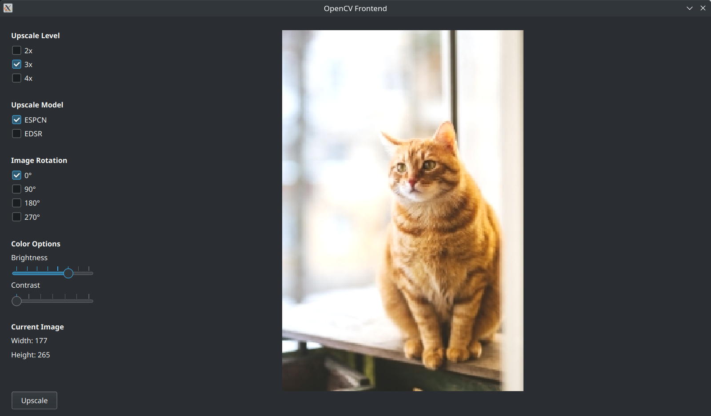

This program is a graphical frontend for the library OpenCV

It uses Python, PyQt5, and OpenCV

Run with the command `python3 Main.py`

It has options for:

- Upscale level (2x, 3x, or 4x)

- Upscale model (ESPCN or EDSR)

- Image rotation (0, 90, 180, or 270 degrees)

- Brightness and contrast manipulation

Some example public-domain photos are stores in the `Tests` folder
